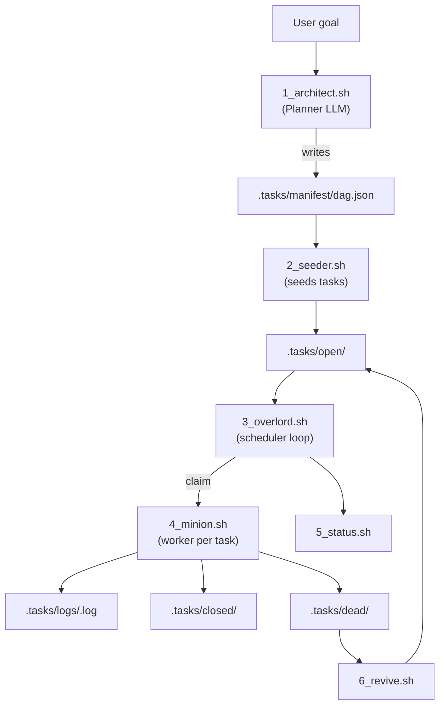
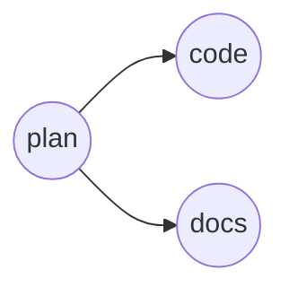
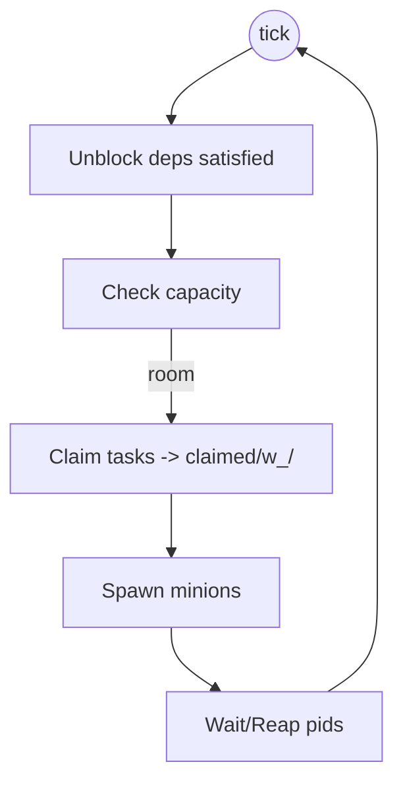
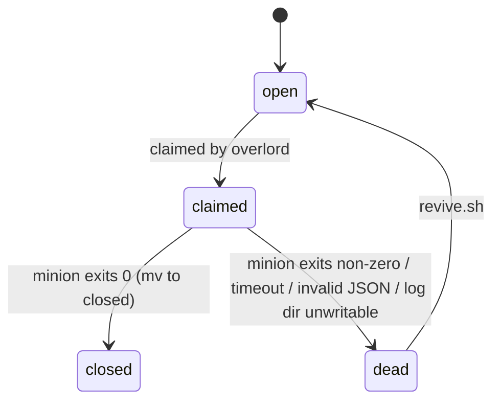

# T.A.S.K.S.


**T**asks **A**re **S**equenced **K**ey **S**teps is a file-system-based autonomous agent runner. It turns a goal into a dependency-ordered DAG, manages tasks via the filesystem, and drives parallel LLM workers to get the work done.

> [!WARNING]
> This gives an LLM write access to your workspace. Run inside git (or a Docker container that copies the repo in) so you can revert if things go sideways.

> [!CAUTION]
> USE AT YOUR OWN RISK. If you run this software, you're unleashing the swarm. Not one LLM going buck wild. Unsupervised. Multiple LLMs.  
> 🥀
> May Claude have mercy on your repo.

## Architecture (Filesystem = Database)

- **setup.sh (Bootstrapper)**: configures env vars and creates the `.tasks/` directory scaffold.
- **1_architect.sh (Architect)**: scans the project and prompts an LLM to emit a JSON DAG.
- **2_seeder.sh (Seeder)**: converts the DAG into per-task JSON files, placing them in `open/` or `blocked/` based on dependencies.
- **3_overlord.sh (Overlord)**: main loop that unblocks tasks when deps close, throttles workers, and spawns minions.
- **4_minion.sh (Minion)**: runs one task via LLM, updates state, and logs output.
- **5_status.sh (Dashboard)**: live view of the state machine.
- **6_revive.sh (Reviver)**: moves failed tasks back to `open/` for retry.

## Prerequisites

- Bash (macOS/Linux/WSL)
- `jq` for JSON parsing
  - macOS: `brew install jq`
  - Linux: `sudo apt-get install jq`
- LLM CLI tool: Default is Anthropic's **Claude Code CLI** (install & configure per the official docs: https://docs.anthropic.com/en/docs/claude-code/overview). Any executable that accepts the prompt as the final argument and prints to stdout will also work.

## Quick Start

```bash
# 0) Make the task scripts executable (avoid chmod-ing everything)
chmod +x setup.sh 1_architect.sh 2_seeder.sh 3_overlord.sh 4_minion.sh 5_status.sh 6_revive.sh

# 1) Initialize directories and env vars
./setup.sh

# 2) Generate a plan (DAG)
./1_architect.sh "Refactor auth to use JWTs"

# 3) Seed tasks
./2_seeder.sh

# 4) Monitor (separate terminal)
./5_status.sh

# 5) Unleash the swarm
./3_overlord.sh
```

## How This Works (End to End)

At a high level, a goal is turned into a dependency graph (DAG), split into per-task JSON files, and executed by worker processes under a scheduler loop. The entire system stores state on disk so it is inspectable and resumable.



### Planner (architect) details
- `1_architect.sh` builds a **planner prompt** from repo context, the user goal, and guardrails.
- It executes `LLM_PLANNER_CMD` (default `claude -p`) and expects **valid JSON** on stdout shaped like:
  ```json
  {
    "tasks": [
      {"id": "plan", "description": "write plan", "deps": []},
      {"id": "code", "description": "implement", "deps": ["plan"]}
    ]
  }
  ```
- The file is saved to `.tasks/manifest/dag.json` and is the single source of truth for the DAG.

### DAG seeding (seeder)
`2_seeder.sh` reads `dag.json` and writes one JSON file per task:
- If a task has **no deps**, its file goes to `.tasks/open/<id>.json`.
- If it has unmet deps, it goes to `.tasks/blocked/<id>.json` with the dep list preserved.

Example DAG to files:



Results on disk:
- `.tasks/open/plan.json`
- `.tasks/blocked/code.json` (deps `["plan"]`)
- `.tasks/blocked/docs.json` (deps `["plan"]`)

### Script roles (expanded)
- **setup.sh** – config & directory scaffold; parses `LLM_WORKER_CMD_JSON`; permission lockdown.
- **1_architect.sh** – planner prompt + LLM -> `dag.json`.
- **2_seeder.sh** – splits DAG into per-task files, routes to `open/` vs `blocked/`.
- **3_overlord.sh** – scheduler loop: unblocks tasks, enforces `MAX_WORKERS`, claims work, spawns minions, waits.
- **4_minion.sh** – executes one task via `LLM_WORKER_CMD` (array), logs output, moves task to `closed/` or `dead/`.
- **5_status.sh** – renders the current tree for humans.
- **6_revive.sh** – moves items from `dead/` back to `open/` for retries.

### Overlord loop (precise)
Each tick of `3_overlord.sh` does:
1) **Unblock**: move any task whose deps are all in `closed/` from `blocked/` -> `open/`.
2) **Capacity check**: count running workers vs `MAX_WORKERS`.
3) **Claim**: atomically move up to the remaining capacity from `open/` -> `claimed/w_<id>/task.json`.
4) **Spawn**: fork `4_minion.sh <worker_id> <task_id>` for each claim; record pid under `.tasks/pids/`.
5) **Reap**: wait for any pid to finish, then loop.



### Task lifecycle (exact states)



Key guarantees:
- All state changes are file moves inside `TASKS_DIR` (atomic on same filesystem).
- Logs are always written to `.tasks/logs/<task_id>.log` before status transition.
- If cleanup fails (e.g., read-only dirs), the minion logs and exits non-zero to surface the issue.

## State Machine (`.tasks/`)

```
.tasks/
├── manifest/        # The Architect's original plan (dag.json)
├── prompts/         # System prompts generated for the LLMs
├── blocked/         # 🛑 Tasks waiting for dependencies to complete
├── open/            # 🟢 Tasks ready to be picked up by workers
├── claimed/         # 🚀 Tasks currently being executed (Mutex Lock)
│   └── w_<id>/      #    (Atomic directory per active worker)
├── closed/          # 🏁 Successfully completed tasks
├── dead/            # 💀 Tasks that failed (exit code != 0)
└── logs/            # 📄 Stdout/Stderr logs for every execution
```

## Setup & Permissions

- `./setup.sh` builds the `.tasks/` tree. By default it sets `umask 077` and enforces `0700` on directories and `0600` on files (defensive hardening).
- Set `TASKS_SKIP_LOCKDOWN=1` to skip the chmod step (useful on shared or constrained filesystems); structure is still created.
- Errors are reported to stderr and the script returns/non-zero without killing the parent shell when sourced.
- `jq` is required if you set `LLM_WORKER_CMD_JSON`; otherwise only Bash and coreutils/find are needed.

## Configuration & LLM Swaps

All runtime config lives in `setup.sh`. Override via env vars before running:

- `TASKS_DIR` (default `$(pwd)/.tasks`): location of the state tree.
- `TASKS_SKIP_LOCKDOWN=1`: create the tree without chmod 700/600 (useful in shared or constrained filesystems).
- `MAX_WORKERS` (default `4`): max concurrent minions.
- `TIMEOUT_SECONDS` (default `300`): per-task timeout applied around the worker command.
- `LLM_PLANNER_CMD` (default `claude -p`): planner that reads the prompt file and goal, writes JSON DAG to stdout.
- `LLM_WORKER_CMD_JSON` (preferred): JSON array of argv tokens for the worker. Required format: non-empty array of strings. Example:
  ```bash
  export LLM_WORKER_CMD_JSON='["python3","my_worker.py","--mode","edit"]'
  ```
  `setup.sh` parses this with `jq`, fails fast if jq is missing or JSON is malformed/empty, and exports `LLM_WORKER_CMD` (array) plus a shell-escaped `LLM_WORKER_CMD_STR` for logging.
- Default worker (when `LLM_WORKER_CMD_JSON` is unset): `claude --dangerously-skip-permissions` executed as argv (no shell). Swap it by setting `LLM_WORKER_CMD_JSON`.

> [!CAUTION]
> The default worker uses `--dangerously-skip-permissions`, which bypasses Claude Code confirmation prompts and grants write access. Use only inside a disposable workspace or git repo, and review `.tasks/logs/*.log` plus `git diff` before committing.

Notes on command execution:
- The worker receives the prompt on STDIN; arguments are not shell-expanded (array is executed directly).
- Paths/flags containing spaces or quotes must be separate JSON array elements—do **not** rely on shell splitting.
- Planner remains string-based for simplicity; it is invoked as a single command line (`$LLM_PLANNER_CMD <prompt> <goal>`). If your planner needs complex argv, wrap it in a small shim script.

## Components At a Glance

| Script          | Role                                      |
|-----------------|-------------------------------------------|
| setup.sh        | Global config; creates directory scaffold |
| 1_architect.sh  | Builds context and writes `dag.json`      |
| 2_seeder.sh     | DAG -> per-task files in .tasks           |
| 3_overlord.sh   | Dependency resolution + worker spawning   |
| 4_minion.sh     | Executes a single task via LLM            |
| 5_status.sh     | Dashboard for current state               |
| 6_revive.sh     | Moves `dead/` tasks back to `open/`       |

## Troubleshooting

- **System looks stuck**: run `./5_status.sh`.
  - If tasks sit in `blocked/`, check that their deps are in `closed/`; restart `./3_overlord.sh` if needed.
  - If tasks pile in `dead/`, inspect `.tasks/logs/<task_id>.log`.
- **Revive failed tasks**: `./6_revive.sh` moves `dead/` -> `open/`.
- **Plans lack context**: bump scan depth in `1_architect.sh` (`find . -maxdepth 6 ...`).

## Testing & CI

- Fast suite (no e2e): `make test` (runs Bats minus `tests/e2e.bats`).
- E2E only: `make test-e2e` (fails fast if `tests/e2e.bats` is missing).
- Dockerized all-tests: `./run-tests.sh` (builds `Dockerfile.test`, runs the full Bats suite in-container).

CI layout:
- `.github/workflows/ci.yml`: ShellCheck on scripts (fast PR gate).
- `.github/workflows/bats-tests.yml`: non-e2e tests in Docker with Buildx cache; ignores doc-only PRs; uploads logs on failure.
- `.github/workflows/cli-e2e.yml`: e2e tests kept separate so long runs do not block main CI.

---

## License

MIT
_© 2025 James Ross • [Flying•Robots](https://github.com/flyingrobots)_
_All Rights Reserved_

---

## Appendix: Environment Variables

| Variable | Default | Used by | Purpose |
|----------|---------|---------|---------|
| `TASKS_DIR` | `$(pwd)/.tasks` | all scripts | Root for state tree (manifest/open/blocked/claimed/closed/dead/logs/pids/prompts). |
| `TASKS_SKIP_LOCKDOWN` | `0` | `setup.sh` | When `1`, creates the tree without chmod 700/600 hardening (useful on shared filesystems). |
| `MAX_WORKERS` | `4` | `setup.sh`, `3_overlord.sh` | Upper bound on concurrent minions the overlord will spawn. |
| `TIMEOUT_SECONDS` | `300` | `4_minion.sh` | Timeout wrapper around the worker command; task fails if exceeded. |
| `LLM_PLANNER_CMD` | `claude -p` | `setup.sh`, `1_architect.sh` | Planner command; must emit valid DAG JSON to stdout. |
| `LLM_WORKER_CMD_JSON` | _unset_ | `setup.sh`, `4_minion.sh` | **Preferred**: JSON array of argv tokens for the worker. Must be a non-empty array. Parsed with `jq` into `LLM_WORKER_CMD`. |
| `LLM_WORKER_CMD` | derived from JSON or default | `setup.sh`, `4_minion.sh` | Array used for execution (no shell eval). Exported for callers; do not set directly—use `LLM_WORKER_CMD_JSON`. |
| `LLM_WORKER_CMD_STR` | derived | `setup.sh`, tests/logs | Shell-escaped string form for logging/debugging; mirrors `LLM_WORKER_CMD`. |
| `OVERLORD_TICKS` | _unset_ | `adapters/control.sh`, `3_overlord.sh` | Optional test/debug guard: if set to a non-negative integer, overlord exits after that many scheduler ticks. |

Notes:
- Derived variables (`LLM_WORKER_CMD`, `LLM_WORKER_CMD_STR`) are computed in `setup.sh`; prefer configuring via `LLM_WORKER_CMD_JSON` only.
- `TASKS_DIR` is respected by all scripts and tests; set once before running any entrypoint.
