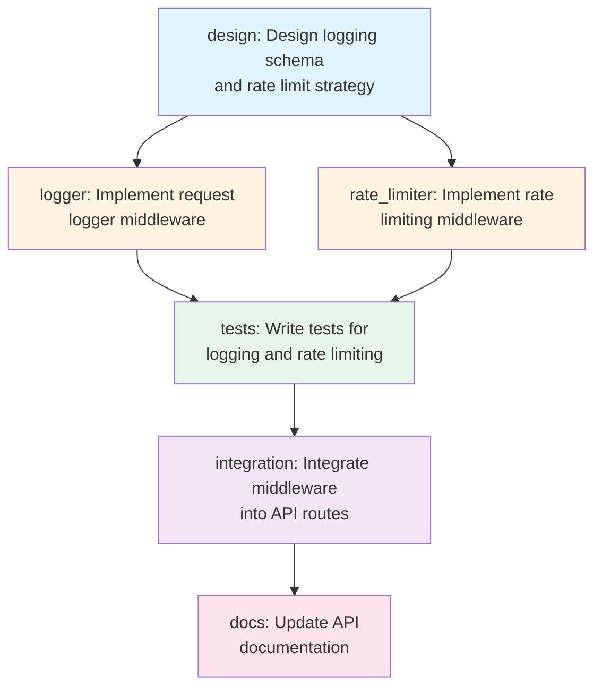
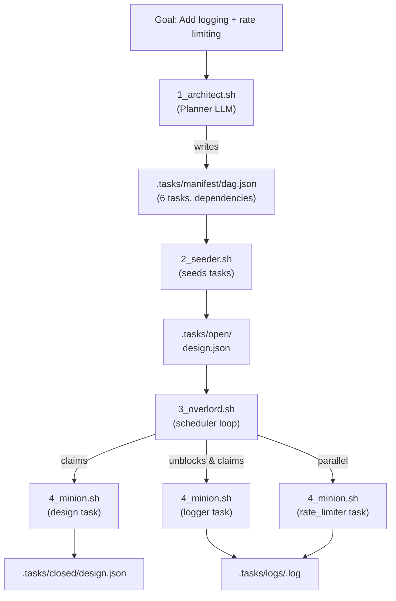
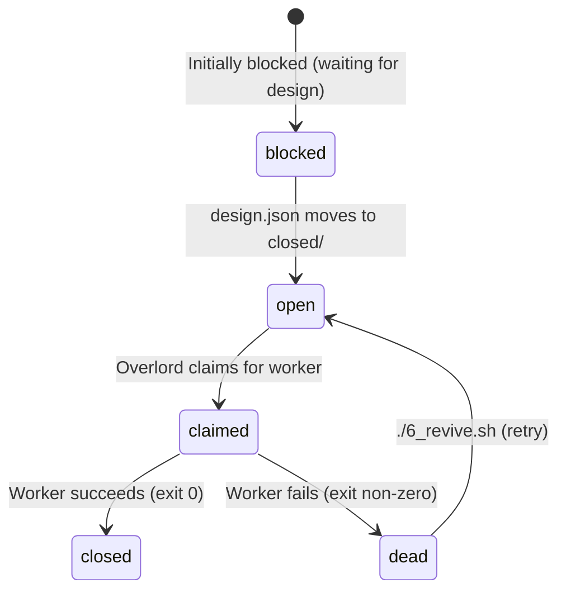
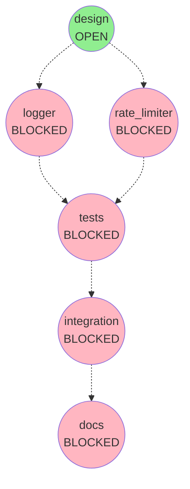

# T.A.S.K.S.


**T**asks **A**re **S**equenced **K**ey **S**teps - A filesystem-based autonomous agent runner that turns goals into dependency-ordered DAGs and executes them with parallel LLM workers.

> [!WARNING]  
> This tool gives an LLM full write access to your repository **including `.git/`**. It can rewrite history, modify refs, delete branches, and corrupt your repo. Use only in a disposable clone, isolated worktree, or container with backups. Before running: (1) make a backup, (2) use a throwaway/shallow clone or temp branch, (3) never run on a production repository.

## What It Does

Give T.A.S.K.S. a goal and watch it work:

**You say**: `"Add request logging and rate limiting to our API"`

**T.A.S.K.S. does**:

1. Generates a dependency-ordered plan (DAG)
2. Breaks work into parallelizable tasks
3. Executes with multiple LLM workers
4. Tracks everything via the filesystem

**The result**: Six tasks execute in optimal order - design work happens first, logger and rate limiter get built in parallel, then tests, integration, and docs follow automatically.

**The filesystem IS the database** - all state lives in visible, inspectable files.

## Quick Start

> [!CAUTION] Dangerous default  
> The default worker command includes `--dangerously-skip-permissions` (Claude Code) which auto-approves edits. For production, override with a safer command (e.g., set `TASKS_LLM_WORKER_CMD_JSON='["claude"]'` or your own worker) and use a throwaway clone/worktree.

**One command (full pipeline):**

```bash
chmod +x tasks.sh  # first time only
TASKS_LLM_WORKER_CMD_JSON='["claude"]' ./tasks.sh "Add request logging and rate limiting to our API"
```

This runs setup → architect → seeder → overlord (rolling frontier) with a default tick limit so it finishes on its own. Logs live in `.tasks/logs/`.

```bash
# One-shot run
./tasks.sh "Add request logging and rate limiting to our API"
```

**What just happened?** The architect generated this plan:



The overlord executes `design` first, then `logger` and `rate_limiter` run in parallel, then everything else follows in order.

## Prerequisites

- Bash (macOS/Linux/WSL)
- `jq` for JSON parsing
    - macOS: `brew install jq`
    - Linux: `sudo apt-get install jq`
- An LLM CLI (default: [Claude Code](https://docs.anthropic.com/en/docs/claude-code/overview))
    - Any CLI that accepts prompts and writes to stdout works

## ⚠️ Important Safety Notes

> [!WARNING] **This gives LLMs write access to your workspace.** Run inside git (or Docker) so you can revert changes.

> [!CAUTION] **USE AT YOUR OWN RISK.** Multiple unsupervised LLMs will modify your codebase in parallel.

The default worker uses `--dangerously-skip-permissions` to bypass Claude Code confirmations. Always:

- Work in a git repo and review diffs before committing
- Or use a disposable Docker container
- Check `.tasks/logs/*.log` to see what happened

---

## How It Works

### Architecture Overview



### The State Machine (`.tasks/`)

After running our example, the filesystem looks like this:

```
.tasks/
├── manifest/
│   └── dag.json                 # Original plan with all 6 tasks
├── prompts/
│   └── architect.txt            # Planner prompt for the DAG
├── blocked/
│   ├── tests.json               # Waiting for logger + rate_limiter
│   ├── integration.json         # Waiting for tests
│   └── docs.json                # Waiting for integration
├── open/
│   └── design.json              # 🟢 Ready to execute
├── claimed/
│   └── w_001/                   # 🚀 Worker 1 is executing design
│       └── design.json
├── closed/                      # 🏁 Nothing completed yet
├── dead/                        # 💀 No failures yet
└── logs/
    └── design.log               # Live output from design task
```

As work progresses:

1. `design.json` moves from `claimed/` → `closed/`
2. `logger.json` and `rate_limiter.json` unblock and move to `open/`
3. Two workers claim and execute them in parallel
4. When both finish, `tests.json` unblocks
5. The chain continues until `docs.json` completes

### Task Lifecycle

Here's what happens to the `logger` task:



Every task follows this same flow.

### Component Roles

|Script|What It Does|Example Output|
|---|---|---|
|`setup.sh`|Creates `.tasks/` structure|Directories, env vars, permissions|
|`1_architect.sh`|Goal → DAG|`dag.json` with 6 tasks|
|`2_seeder.sh`|DAG → individual task files|`design.json` in `open/`, others in `blocked/`|
|`3_overlord.sh`|Dependency resolution + spawning|Unblocks tasks, spawns workers|
|`4_minion.sh`|Executes one task|Runs LLM, writes `logger.log`|
|`5_status.sh`|Live dashboard|Shows what's running/blocked/done|
|`6_revive.sh`|Retry failed tasks|Moves `dead/` → `open/`|

---

## Configuration

All settings live in `setup.sh`. Override via environment variables:

### Essential Settings

|Variable|Default|Purpose|
|---|---|---|
|`TASKS_MAX_WORKERS`|`4`|Max concurrent workers (could run `logger` and `rate_limiter` simultaneously)|
|`TASKS_TIMEOUT_SECONDS`|`300`|Kill a task if it takes longer than this|
|`TASKS_DIR`|`$(pwd)/.tasks`|Where state lives|

### LLM Configuration

**Worker Command (Preferred):**

```bash
export TASKS_LLM_WORKER_CMD_JSON='["claude", "--dangerously-skip-permissions"]'
```

**Planner Command:**

```bash
export TASKS_LLM_PLANNER_CMD="claude -p"
```

Want to use a different LLM? Just point to any CLI that reads stdin and writes to stdout:

```bash
export TASKS_LLM_WORKER_CMD_JSON='["python3", "my_worker.py", "--mode", "edit"]'
```

### Advanced Options

|Variable|Default|Purpose|
|---|---|---|
|`TASKS_SKIP_LOCKDOWN`|`0`|Set to `1` to skip chmod 700/600 hardening|
|`TASKS_SLEEP_SECONDS`|`2`|Delay between scheduler ticks|
|`TASKS_OVERLORD_TICKS`|_unset_|Limit ticks (testing/debug)|

---

## Detailed Operation

<details> <summary><strong>Planning Phase (architect)</strong></summary>

When the orchestrator runs the **planning phase** (tasks.sh calls `1_architect.sh` under the hood):

The architect:

1. Scans your repo for context (file tree, key files)
2. Builds a prompt with your goal and guardrails
3. Asks the LLM to generate a DAG

The LLM returns JSON like this:

```json
{
  "tasks": [
    {
      "id": "design",
      "description": "Design logging schema and rate limit strategy",
      "dependencies": []
    },
    {
      "id": "logger",
      "description": "Implement request logger middleware",
      "dependencies": ["design"]
    },
    {
      "id": "rate_limiter",
      "description": "Implement rate limiting middleware",
      "dependencies": ["design"]
    },
    {
      "id": "tests",
      "description": "Write tests for logging and rate limiting",
      "dependencies": ["logger", "rate_limiter"]
    },
    {
      "id": "integration",
      "description": "Integrate middleware into API routes",
      "dependencies": ["tests"]
    },
    {
      "id": "docs",
      "description": "Update API documentation",
      "dependencies": ["integration"]
    }
  ]
}
```

Saved to `.tasks/manifest/dag.json`.

</details> <details> <summary><strong>Seeding Phase (seeder)</strong></summary>

`2_seeder.sh` converts the DAG into individual task files:

**Initial state after seeding**:

- ✅ `.tasks/open/design.json` (no dependencies, ready to go)
- 🛑 `.tasks/blocked/logger.json` (waiting for `design`)
- 🛑 `.tasks/blocked/rate_limiter.json` (waiting for `design`)
- 🛑 `.tasks/blocked/tests.json` (waiting for `logger` AND `rate_limiter`)
- 🛑 `.tasks/blocked/integration.json` (waiting for `tests`)
- 🛑 `.tasks/blocked/docs.json` (waiting for `integration`)

The dependency structure looks like this:



</details> <details> <summary><strong>Execution Phase (overlord + minions)</strong></summary>

The overlord loop (`3_overlord.sh`) orchestrates everything as a **rolling frontier**: it keeps claiming new work whenever capacity frees up; it never waits for all current tasks to finish before moving on.

**Tick 1 (rolling frontier start)**:

1. Checks capacity: 0/4 workers running
2. Claims `design.json` from `open/` → `claimed/w_001/`
3. Spawns: `4_minion.sh 001 design`
4. Waits for completion

**Tick 2** (after `design` completes):

1. Unblocks: `logger.json` and `rate_limiter.json` move to `open/` (dependencies satisfied!)
2. Checks capacity: 0/4 workers running
3. Claims both tasks
4. Spawns: `4_minion.sh 002 logger` and `4_minion.sh 003 rate_limiter` **in parallel**
5. Waits for both to complete

**Tick 3** (after both finish):

1. Unblocks: `tests.json` moves to `open/` (both dependencies satisfied)
2. Claims and executes `tests`
3. Pattern continues: `integration` → `docs`

Each minion receives a prompt template (default: `$TASKS_DIR/prompts/worker.txt`, override with `TASKS_WORKER_PROMPT_TEMPLATE`) that:

- Explicitly **forbids running git commands**
- Warns it is working alongside other workers on the same branch (expect transient test/build/edit failures from concurrent edits)
- Includes placeholders `{{TASK_ID}}` and `{{TASK_DESCRIPTION}}` that are filled per task

Minion behavior:
- Executes via `TASKS_LLM_WORKER_CMD`
- Writes everything to `.tasks/logs/<task_id>.log`
- On success: moves task to `closed/`
- On failure: moves task to `dead/`

**Why this matters**: `logger` and `rate_limiter` run simultaneously, cutting total execution time roughly in half compared to sequential execution.

</details>

---

## Troubleshooting

### Monitor Progress

```bash
./5_status.sh
```

Example output during execution:

```
🟢 OPEN (0)
🚀 CLAIMED (2)
   - w_002: logger
   - w_003: rate_limiter
🛑 BLOCKED (3)
   - tests (waiting for: logger, rate_limiter)
   - integration (waiting for: tests)
   - docs (waiting for: integration)
🏁 CLOSED (1)
   - design
💀 DEAD (0)
```

### Common Issues

**Tasks stuck in `blocked/`:**

- Check if dependencies are in `closed/`
- Example: If `tests` is stuck, verify both `logger` and `rate_limiter` completed
- Restart orchestration: rerun `./tasks.sh "<goal>"` (or `./3_overlord.sh` if you only need the scheduler)

**Tasks in `dead/`:**

```bash
# Check what went wrong
cat .tasks/logs/logger.log

# Retry failed tasks
./6_revive.sh
```

Example failure scenario:

```
💀 DEAD (1)
   - rate_limiter

$ cat .tasks/logs/rate_limiter.log
Error: Could not import redis module
...
```

Fix the issue (install redis), then revive:

```bash
./6_revive.sh  # Moves rate_limiter.json: dead/ → open/
./tasks.sh "<goal>"  # Or run ./3_overlord.sh to resume scheduling only
```

**Plans lack context:** If you increase scan depth in `1_architect.sh`, also **exclude sensitive and heavy paths** (e.g., `.env`, `secrets/`, `.ssh/`, `node_modules/`, `vendor/`, `dist/`).  
⚠️ The planner ingests whatever you scan; secrets can leak into `dag.json` or logs. Prefer explicit `--exclude` patterns or a safe whitelist when bumping `-maxdepth` so sensitive files are never read.

---

## Testing & CI

Local testing:

```bash
make test        # Fast suite (no e2e)
make test-e2e    # E2E tests only
./run-tests.sh   # Full suite in Docker
```

CI Workflows:

- **ci.yml**: ShellCheck on all scripts (fast PR gate)
- **bats-tests.yml**: Non-e2e tests with Buildx cache
- **cli-e2e.yml**: E2E tests (separate to avoid blocking main CI)

---

## Complete Environment Reference

<details> <summary><strong>All Configuration Variables</strong></summary>

|Variable|Default|Used By|Purpose|
|---|---|---|---|
|`TASKS_DIR`|`$(pwd)/.tasks`|All scripts|Root directory for state tree|
|`TASKS_SKIP_LOCKDOWN`|`0`|`setup.sh`|Skip chmod hardening when `1`|
|`TASKS_MAX_WORKERS`|`4`|`setup.sh`, `3_overlord.sh`, `lib/domain.sh`|Max concurrent minions|
|`TASKS_TIMEOUT_SECONDS`|`300`|`setup.sh`, `4_minion.sh`|Per-task timeout|
|`TASKS_LLM_PLANNER_CMD`|`claude -p`|`setup.sh`, `1_architect.sh`, `adapters/llm_planner.sh`|Planner command|
|`TASKS_LLM_WORKER_CMD_JSON`|_unset_|`setup.sh`, `4_minion.sh`|Worker command (JSON array)|
|`TASKS_LLM_WORKER_CMD`|Derived|`setup.sh`, `4_minion.sh`, `adapters/llm_worker.sh`|Worker command (internal array)|
|`TASKS_LLM_WORKER_CMD_STR`|Derived|`setup.sh`, tests/logs|Shell-escaped for display|
|`TASKS_OVERLORD_TICKS`|_unset_|`adapters/control.sh`, `3_overlord.sh`|Test/debug tick limit|
|`TASKS_SLEEP_SECONDS`|`2`|`3_overlord.sh`|Loop delay|
|`TASKS_WORKER_PROMPT_TEMPLATE`|`$TASKS_DIR/prompts/worker.txt`|`setup.sh`, `4_minion.sh`|Path to worker prompt template (placeholders: `{{TASK_ID}}`, `{{TASK_DESCRIPTION}}`).|
|`TASKS_ARCHITECT_TEMPLATE`|`$TASKS_DIR/prompts/architect_template.txt`|`setup.sh`, `1_architect.sh`|Path to planner prompt template (placeholder: `{{GOAL}}`).|

</details>

---

## Understanding the Example Output

When everything runs successfully, you'll see this progression:

```bash
# Initial state (after seeding)
$ ./5_status.sh
🟢 OPEN (1): design
🛑 BLOCKED (5): logger, rate_limiter, tests, integration, docs

# After design completes
🟢 OPEN (2): logger, rate_limiter
🛑 BLOCKED (3): tests, integration, docs
🏁 CLOSED (1): design

# During parallel execution
🚀 CLAIMED (2): logger, rate_limiter
🛑 BLOCKED (3): tests, integration, docs
🏁 CLOSED (1): design

# After parallel work completes
🟢 OPEN (1): tests
🛑 BLOCKED (2): integration, docs
🏁 CLOSED (3): design, logger, rate_limiter

# Final state
🏁 CLOSED (6): design, logger, rate_limiter, tests, integration, docs
```

Check the logs to see what each worker actually did:

```bash
ls -l .tasks/logs/
# design.log         - Architecture decisions
# logger.log         - Middleware implementation
# rate_limiter.log   - Rate limiting logic
# tests.log          - Test suite
# integration.log    - Route updates
# docs.log           - Documentation changes
```

---

## License

MIT  
_© 2025 James Ross • [Flying•Robots](https://github.com/flyingrobots)_  
_All Rights Reserved_
